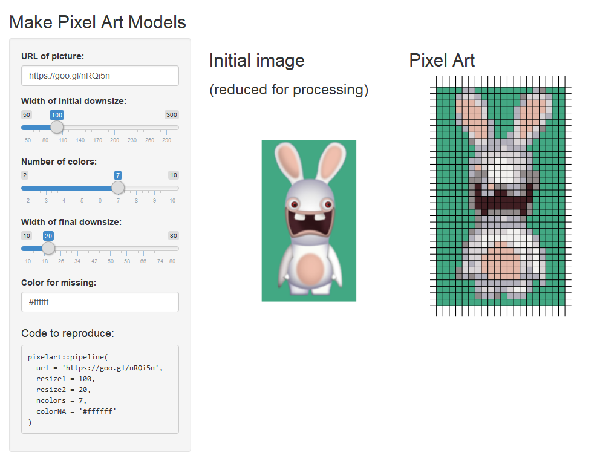
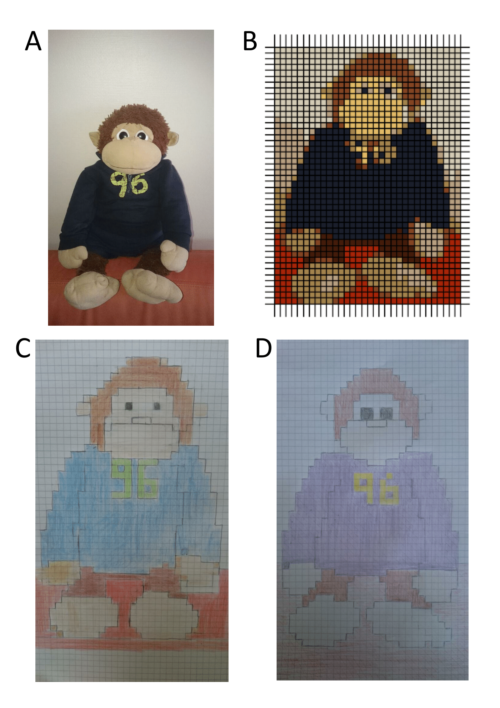

# Package pixelart

R Package to make Pixel Art models. [[Blog post introducing the package]](https://privefl.github.io/blog/shiny-app-for-making-pixel-art-models/)

```r
# Installation
devtools::install_github("privefl/pixelart")

# Run Shiny App
pixelart::run_app()
```

Webshot of Shiny App:

<center></center>

## Example

I present you Kong. **A.** Picture of Kong. **B.** Kong as a pixel art model, created with R package pixelart. **C. & D.** Two pixel art drawings of Kong, based on A & B.

<center></center>

## News

- Nov 18: added some options for croping, rotating and saturating the image.
