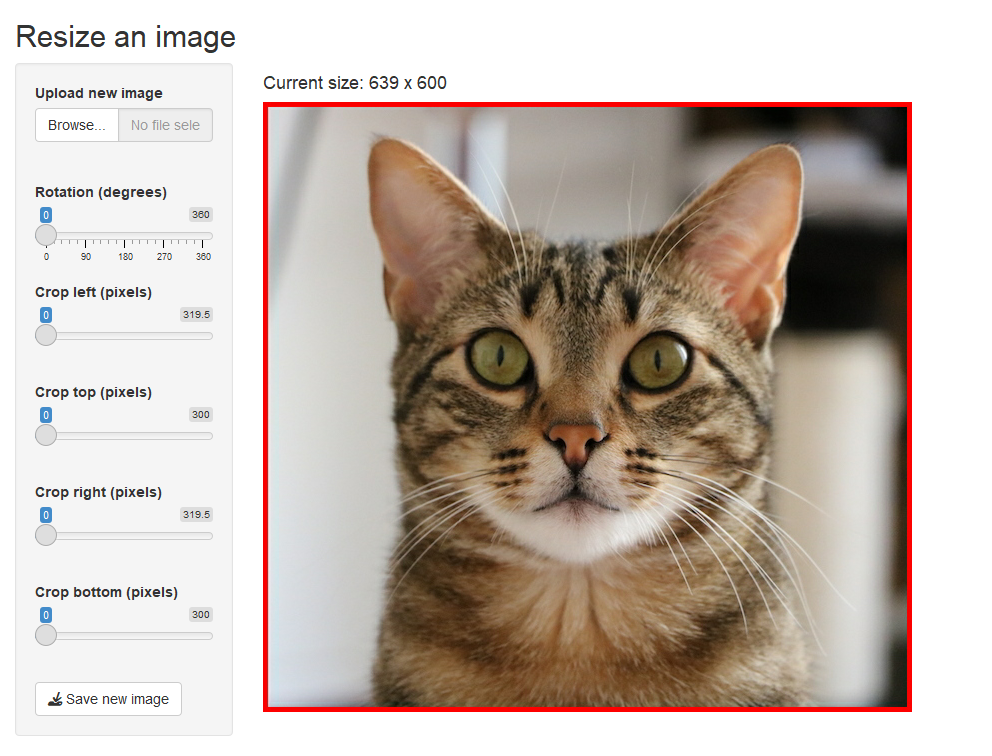

<!-- badges: start -->
[](https://github.com/privefl/pixelart/actions/workflows/R-CMD-check.yaml)
[](https://CRAN.R-project.org/package=pixelart)
<!-- badges: end -->

# R package {pixelart}

R Package to resize and crop images, and make Pixel Art models from your own pictures.    
[[Blog post introducing the package]](https://privefl.github.io/blog/shiny-app-for-making-pixel-art-models/)

```r
# Installation from CRAN
install.packages("pixelart")

# Installation from GitHub
remotes::install_github("privefl/pixelart")

# Run Shiny app for pixel art models
pixelart::run_pixelart()

# Run Shiny app for resizing an image
pixelart::run_resize()
```

### Webshot of Shiny App for Pixel Art:

<center></center>

### Webshot of Shiny App for cropping images:

<center></center>

### Example

I present you Kong. **A.** Picture of Kong. **B.** Kong as a pixel art model, created with R package pixelart. **C. & D.** Two pixel art drawings of Kong, based on A & B.

<center></center>

### News

- October 24, 2024: release on CRAN

- August 1, 2018: add Shiny app for resizing images.

- March 10, 2018: run kmeans in the Lab space (instead of the RGB space)

- Nov 18, 2017: added some options for croping, rotating and saturating the image

### To improve

I think there is room for improving the pixel art models (e.g. better separation of colors). Maybe with [package imager](https://CRAN.R-project.org/package=imager/vignettes/pixsets.html). Ideas are welcome.
